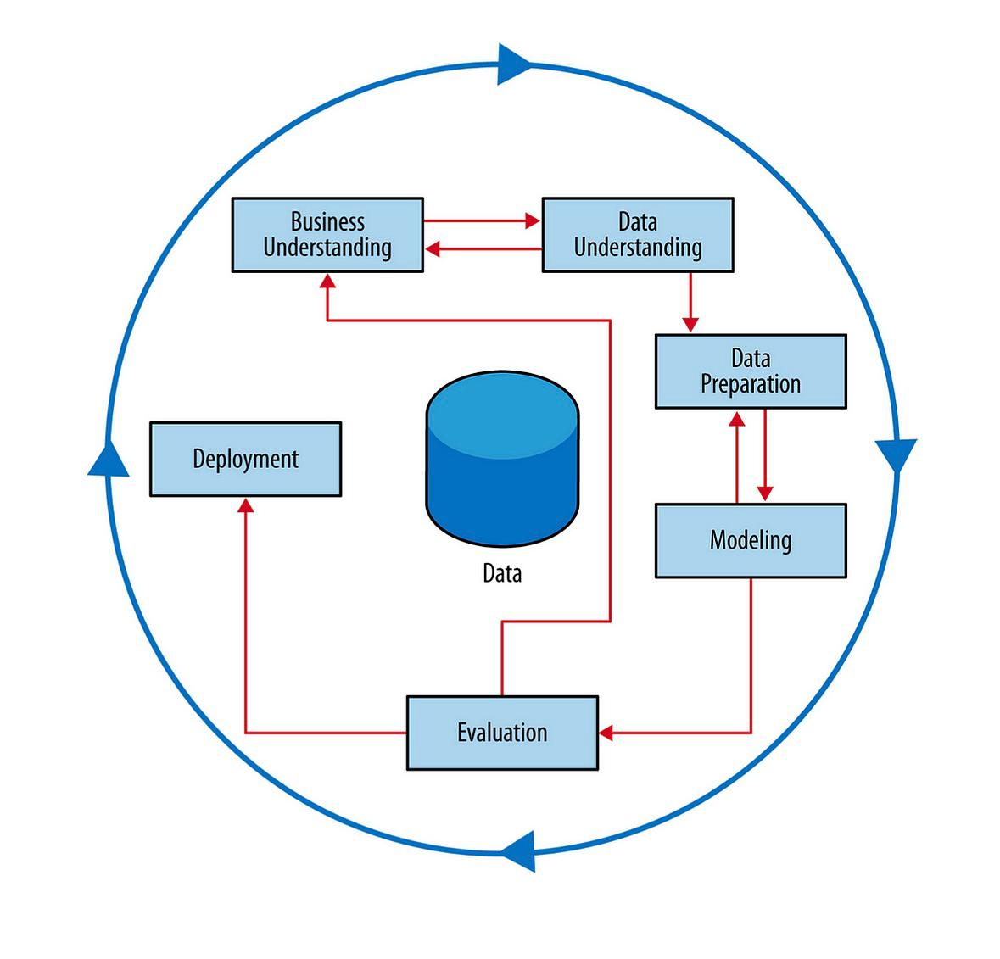
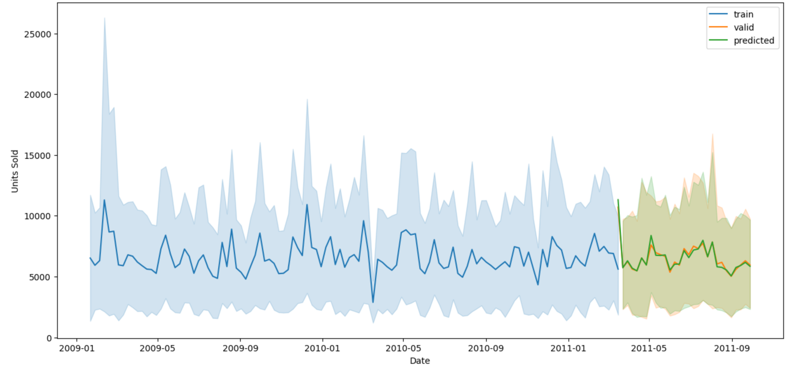

#  Demand Forecasting & Analysis for FMCG Retailer

## Project Overview

This project presents a **data science and forecasting solution** developed for a large offline **FMCG (Fast-Moving Consumer Goods)** retailer. The main objective is to extract **business insights** from sales, product, and store data to guide **smarter inventory planning** and reduce lost revenue.

The project follows the **CRISP-DM framework** (Cross Industry Standard Process for Data Mining), ensuring a structured and repeatable approach to insight generation and forecasting.

Using a combination of **EDA, feature engineering, statistical methods**, and a machine learning-based **forecasting model**, we help business planners understand demand drivers, optimize stock allocation, and anticipate next week’s sales.

##  1. Business Understanding

The retailer faced frequent **inventory misalignments**, leading to:

*  Lost sales during unexpected demand peaks
* Overstocking and storage waste
*  Inefficient replenishment cycles and resource usage

The goal was to create a **data-driven solution** that forecasts weekly product demand and reveals the patterns behind sales fluctuations—empowering planners to make better stocking and resource decisions.

##  2. Data Understanding

The project integrates and explores three primary datasets:

* **Sales Data**: Weekly sales, prices, discounts, and promotions
* **Product Data**: Category, size, UPC, and brand info
* **Store Data**: Store ID, location, type, and segmentation

➡ All data was queried using **SQL in Google BigQuery** and analyzed in **Python (Colab environment)**.

Exploratory Data Analysis (EDA) was performed to:

* Identify seasonal demand patterns
* Understand category and store-level trends
* Examine the effects of promotions and pricing on sales

##  3. Data Preparation

After data cleaning and schema alignment, key transformations included:

* Time-series structuring by store and category
* Lag features (previous week’s sales)
* Rolling averages to capture recent trends
* Calendar-based features (e.g., week of year, month)
* Promotion flags and price normalization

##  4. Modeling

The goal was to build a robust weekly forecasting model:

* **Model Used**: XGBoost Regressor
* **Target**: Weekly units sold per product-store-category
* **Features**: Lag values, pricing, promotion indicators, temporal patterns
* **Train/Valid Split**: Time-aware
* **Evaluation Metric**: RMSLE (Root Mean Squared Logarithmic Error)

##  5. Evaluation

Model performance was visualized over the train, validation, and predicted windows. This helped verify how accurately the model captures real-world fluctuations in demand:

## 6. Deployment

An interactive **Streamlit dashboard** was developed and deployed on **AWS EC2**, enabling:

* Selection of product categories and store segments
* Visualization of predicted weekly demand
* Comparison of performance across time and location

The app helps planners and stakeholders interact with the model’s output in an intuitive, business-friendly format.

## Contact

* [LinkedIn](https://www.linkedin.com/in/hadeel-als)
* [Email](mailto:alsaadonhadeel@gmail.com)
